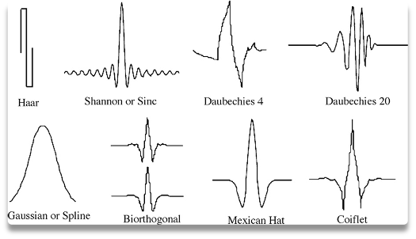
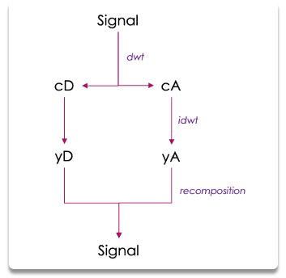
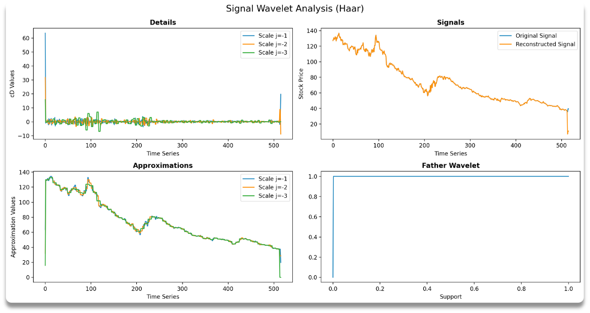
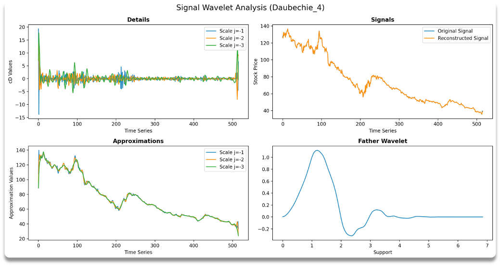

# Wavelets

## 1 - Introduction

#### What is a wavelet ?

Small wave with a defined start and end. A signal can be reconstructed as the sum of small dilated and translated wavelets.

 

  
   
  <b>Fig.1</b> - Wavelets Examples

 

#### Why do we use wavelets ?  

Break down a signal into 2 components of various scales and frequencies. Financial applications:
* Denoising
* Singularity prediction
* Detection of frequency patterns
* ...

 

## 2 - Building the Wavelets

### Daubechie

The daubechie wavelet's are orthognal with a compact support. Their are the more commonly used for the discrete wavelet transformation.

#### Father Wavelet

  

*Tip: To construct the father wavelet we use a cascade algorithm*

 

#### Mother Wavelet

  

#### Derived Wavelets

  

  

*Tip: To reduce computing time one can take* 

 

### Mexican Hat

Yet to be implemented ...

 

## 3 - Decomposition/Recomposition

Using a discrete Wavelet (Daubechie for example) one can easily decompose and recompose perfectly the signal by doing the following steps:

 

  
   
  <b>Fig.2</b> - Signal Decomposition/Recomposition

#### Discrete Wavelet Transform (dwt)

  

  

#### Inverse Discrete Wavelet Transform (idwt)

  

  

#### Signal Recomposition

  

#### Examples

  
   
  <b>Fig.3</b> - Haar Decomposition/Recomposition

  
   
  <b>Fig.4</b> - Daubechie_4 Decomposition/Recomposition

*Tip: Use main_signal.py to plot thoses graphs*

 

## 4 - Signal Denoising

To denoise a signal one simply needs to denoise the details coefficients:

  
   
  <b>Fig.4</b> - Signal Denoising

